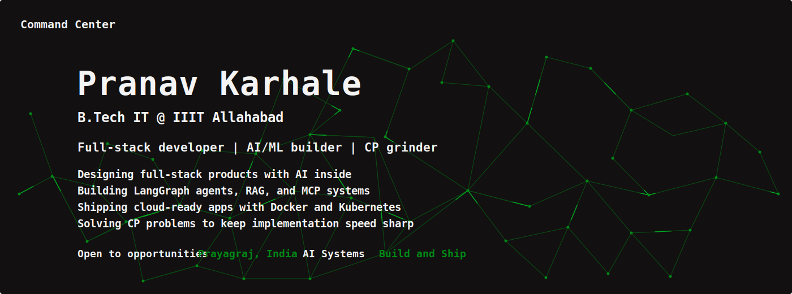
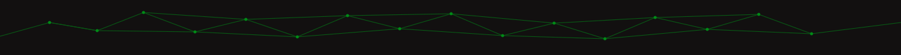
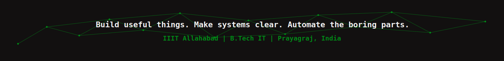

<div align="center">



<br />
<br />

<a href="#command-center"></a>
<a href="#currently-building"></a>
<a href="#tech-stack"></a>
<a href="#project-showroom"></a>
<a href="#competitive-programming"></a>
<a href="#lets-connect"></a>

<br />
<br />


</div>



## Command Center

<table>
  <tr>
    <td width="58%" valign="top">
      <h3>Builder profile</h3>
      <p>
        I build <b>production-ready full-stack products</b> and explore the intersection of
        <b>AI agents</b>, <b>RAG</b>, <b>MCP tooling</b>, cloud infrastructure, and fast problem solving.
      </p>
      <p>
        My current lane is practical systems: ideas that can become usable products,
        workflows that can be automated, and code that survives outside a demo.
      </p>
      <p>
        
        
        
      </p>
    </td>
    <td width="42%" valign="top">
      <h3>Live snapshot</h3>
      <table>
        <tr>
          <td><b>Program</b></td>
          <td>B.Tech IT @ IIIT Allahabad</td>
        </tr>
        <tr>
          <td><b>Now</b></td>
          <td>LangGraph, RAG, MCP, Kubernetes</td>
        </tr>
        <tr>
          <td><b>Practice</b></td>
          <td>Competitive programming + systems</td>
        </tr>
        <tr>
          <td><b>Exploring</b></td>
          <td>Security, quant ideas, automation</td>
        </tr>
      </table>
    </td>
  </tr>
</table>

<details open>
<summary><b>Open terminal intro</b></summary>

```bash
$ whoami
Pranav Karhale

$ cat about.txt
B.Tech IT @ IIIT Allahabad
Full-stack developer | AI/ML builder | CP grinder 

$ git log --oneline --all
a3f1b2c feat: LangGraph agents + RAG + MCP integrated systems
7e1f9d2 chore: Kubernetes production deployment across AWS/Azure/GCP
4c9a880 build: turn ideas into product-grade workflows
```

</details>

<table>
  <tr>
    <td width="25%" align="center">
      
      <br /><br />
      <b>Full-stack apps</b>
      <br />
      UI, APIs, auth, data, deployment
    </td>
    <td width="25%" align="center">
      
      <br /><br />
      <b>AI workflows</b>
      <br />
      LangGraph, RAG, MCP, tooling
    </td>
    <td width="25%" align="center">
      
      <br /><br />
      <b>Infra</b>
      <br />
      Docker, Kubernetes, cloud
    </td>
    <td width="25%" align="center">
      
      <br /><br />
      <b>Problem solving</b>
      <br />
      Graphs, DP, greedy, geometry
    </td>
  </tr>
</table>


## Currently Building

<table>
  <tr>
    <td width="50%" valign="top">
      <h3>Active focus</h3>
      <ul>
        <li>LangGraph agents with RAG-backed workflows</li>
        <li>MCP-integrated systems and tool orchestration</li>
        <li>Kubernetes production deployments</li>
        <li>Networks, security, low-level programming, and trading</li>
      </ul>
    </td>
    <td width="50%" valign="top">
      <h3>Learning loop</h3>
      <ul>
        <li>Build small, ship quickly, measure behavior</li>
        <li>Turn notes into reusable systems</li>
        <li>Use CP to sharpen implementation speed</li>
        <li>Study quant ideas with disciplined experiments</li>
      </ul>
    </td>
  </tr>
</table>

<table>
  <tr>
    <td width="33%" valign="top">
      <h3>Designing</h3>
      <p>Interfaces and workflows that feel clear, fast, and useful from the first click.</p>
      
    </td>
    <td width="33%" valign="top">
      <h3>Automating</h3>
      <p>Agentic workflows that connect tools, memory, retrieval, and decision logic.</p>
      
    </td>
    <td width="33%" valign="top">
      <h3>Deploying</h3>
      <p>Cloud-ready systems with containers, observability habits, and clean APIs.</p>
      
    </td>
  </tr>
</table>


## Tech Stack

<table>
  <tr>
    <td width="50%" valign="top">
      <h3>Frontend</h3>
      <p>
        
        
        
      </p>
    </td>
    <td width="50%" valign="top">
      <h3>Backend and languages</h3>
      <p>
        
        
        
        
        
      </p>
    </td>
  </tr>
  <tr>
    <td width="50%" valign="top">
      <h3>AI / ML</h3>
      <p>
        
        
        
        
      </p>
    </td>
    <td width="50%" valign="top">
      <h3>Infra, cloud, and data</h3>
      <p>
        
        
        
        
        
      </p>
    </td>
  </tr>
</table>

## GitHub Dashboard

<div align="center">


<br />
<br />


<br />
<br />


<br />
<br />


<br />
<br />


</div>


## Project Showroom

<table>
  <tr>
    <td width="50%" valign="top">
      <h3><a href="https://github.com/Pranav12-karhale/Resilia">Resilia</a></h3>
      <p><b>Adaptive Supply Chain Platform</b></p>
      <p>
        AI-driven resilience engine with LangGraph agents and RAG-based disruption response.
        Built for real-time decision support across a Flutter + Node.js stack.
      </p>
      <p>
        
        
        
        
      </p>
      <a href="https://github.com/Pranav12-karhale/Resilia">
        
      </a>
    </td>
    <td width="50%" valign="top">
      <h3><a href="https://github.com/Pranav12-karhale/Oasis">Oasis</a></h3>
      <p><b>Dynamic Health Suggestion Platform</b></p>
      <p>
        Health-focused suggestion platform designed around adaptive recommendations,
        practical user guidance, and product-friendly decision flows.
      </p>
      <p>
        
        
        
      </p>
      <a href="https://github.com/Pranav12-karhale/Oasis">
        
      </a>
    </td>
  </tr>
</table>

<table>
  <tr>
    <td width="33%" valign="top">
      <h3>AI systems lab</h3>
      <p>Agents, retrieval, tool use, graph workflows, and product-grade automation experiments.</p>
      
    </td>
    <td width="33%" valign="top">
      <h3>Cloud operations</h3>
      <p>Containerized services, deployment pipelines, and observability-minded architecture.</p>
      
    </td>
    <td width="33%" valign="top">
      <h3>Problem solving</h3>
      <p>Algorithm practice translated into cleaner implementation habits and faster debugging.</p>
      
    </td>
  </tr>
</table>

## Competitive Programming

<div align="center">

[](https://leetcode.com/u/_pranav_1212/)
[](https://www.codechef.com/users/lumenive_h1)
[](https://codeforces.com/profile/casualuse1045)
[](https://www.hackerrank.com/profile/casualuse1045)
[](https://www.interviewbit.com/profile/pranav_664)

</div>

<table>
  <tr>
    <td width="25%" align="center"><b>Dynamic programming</b><br />State design, transitions, optimization</td>
    <td width="25%" align="center"><b>Graphs</b><br />BFS/DFS, shortest paths, trees, DSU</td>
    <td width="25%" align="center"><b>Greedy</b><br />Exchange arguments, sorting, invariants</td>
    <td width="25%" align="center"><b>Geometry</b><br />Vectors, intersections, precision</td>
  </tr>
</table>

<details>
<summary><b>Problem-solving focus</b></summary>
<br />

Currently grinding <b>400+ problems</b> across platforms.

| Focus area | What I practice |
|---|---|
| Dynamic programming | State design, transitions, optimization |
| Graph algorithms | BFS/DFS, shortest paths, trees, DSU |
| Greedy strategies | Exchange arguments, sorting, invariants |
| Computational geometry | Vectors, intersections, precision |

</details>

## Interests

<table>
  <tr>
    <td width="25%" valign="top">
      <h3>Competitive programming</h3>
      <p>C++ heavy practice across graphs, DP, greedy, and geometry.</p>
    </td>
    <td width="25%" valign="top">
      <h3>Systems and infra</h3>
      <p>Kubernetes, MCP architecture, RAG architecture, and agentic systems.</p>
    </td>
    <td width="25%" valign="top">
      <h3>Android development</h3>
      <p>Mobile product ideas and Flutter workflows.</p>
    </td>
    <td width="25%" valign="top">
      <h3>Quant trading</h3>
      <p>Algorithmic strategies, TradingView, and disciplined backtesting.</p>
    </td>
  </tr>
</table>


## Lets Connect

<div align="center">

[](https://www.linkedin.com/in/pranav-karhale-1191b2381)
[](mailto:casualuse1045@gmail.com)
[](mailto:iit2024048@iiita.ac.in)

<br />
<br />


</div>

---

<div align="center">
  
</div>
